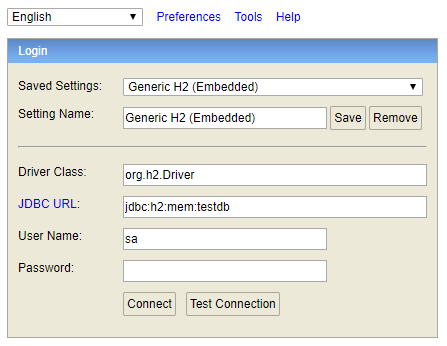
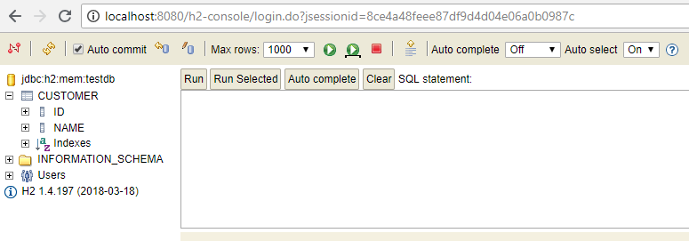

# spring-boot-h2-console
The main goal of this project is to show how to configure h2 console for 
Spring Boot web application.

_Reference_: [Spring Boot h2 console config](https://medium.com/@harittweets/how-to-connect-to-h2-database-during-development-testing-using-spring-boot-44bbb287570)

# preface
H2 is a perfect choice for in-memory databases during testing since we do 
not have to install the database.

Often times during development we would want to look inside the database 
to view the schema or data.

In some cases, only one connection to a in-memory database is required. 
This means the database to be opened is private. In this case, the database 
URL is `jdbc:h2:mem:`.  
**Remark**: Opening two connections within the same virtual 
machine means opening two different (private) databases.

Sometimes multiple connections to the same in-memory database are required. 
In this case, the database URL must include a name. 
Example: `jdbc:h2:mem:db1`.  
**Remark**: Accessing the same database using this `URL` only 
works within the same virtual machine and class loader environment.

# configuration
* `pom.xml`
    ```
     <dependency>
       <groupId>com.h2database</groupId>
       <artifactId>h2</artifactId>
       <scope>runtime</scope>
     </dependency>
    ```
* `application.properties`
    ```
    spring.h2.console.enabled=true
    spring.h2.console.path=/h2-console
    ```

# alternative configuration
* `pom.xml`
    ```
    <dependency>
        <groupId>org.springframework.boot</groupId>
        <artifactId>spring-boot-devtools</artifactId>
        <optional>true</optional>
    </dependency>
    ```
    
# logging
1. Start the application.
1. Type `http://localhost:8080/h2-console` in your browser.
1. Enter the credentials:

    
    ```
    JDBC URL: jdbc:h2:mem:testdb
    User Name: sa
    Pasword: <leave this empty>
    ``` 
1. Console

    